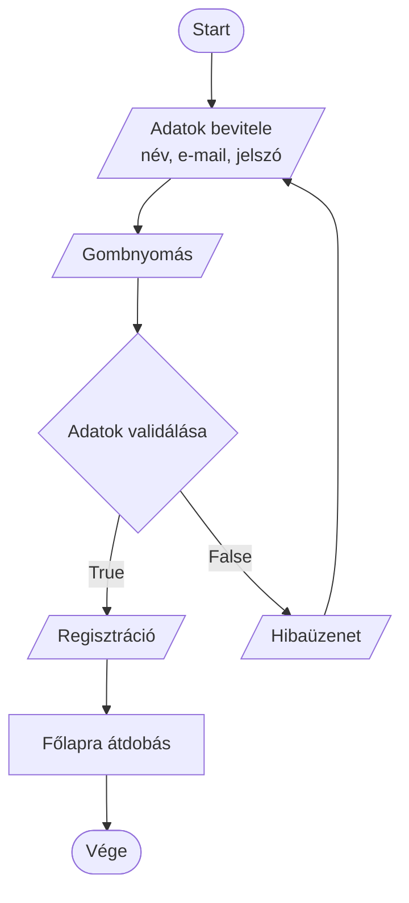

# Bejelentkezési folyamat

```mermaid
flowchart TD
    Start([Start]) --> InputData[/Adatok bevitele<br/>név, e-mail, jelszó/]
    InputData --> ButtonPress[/Gombnyomás/]
    ButtonPress --> Validate{Adatok validálása}
    Validate -->|True| Register[/Regisztráció/]
    Validate -->|False| Error[/Hibaüzenet/]
    Error --> InputData
    Register --> Login[Főlapra átdobás]
    Login --> End([Vége])
```
